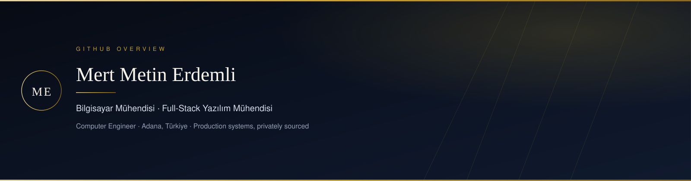

  

  <h1>Mert Metin Erdemli</h1>
  

    <strong>Bilgisayar Mühendisi</strong> · Full-Stack Yazılım Mühendisi 
    İş problemini anlarım, sistemi kurarım, production’da sahiplenirim.
  

  
<em>I turn operational problems into production systems — architecture, backend, interface, and the live operation.</em>

  
Adana, Türkiye · İşveren ekipleri ve müşteri işleri · Remote uyumlu

  

    
    
    
    
    
  

> [!IMPORTANT]
> **Production uygulamalarımın kaynak kodu private repository’lerdedir.**
> Bu public GitHub profili arşiv, eğitim çalışmaları ve açık denemeleri gösterir. Canlı müşteri / şirket sistemlerinin kaynağını burada yayınlamıyorum.
>
> **Demo, walkthrough veya teknik inceleme** için iletişime geçin — production ürünleri birlikte inceleriz.
> [e-posta](mailto:erdemlimertmetin@gmail.com) · [telefon](tel:+905061058792) · [LinkedIn](https://www.linkedin.com/in/erdemlimertmetin)

---

## Hakkımda

Bir ürünü yalnızca “yazmıyorum”. İhtiyacı dinliyorum, iş akışını modelliyor, mimariyi kuruyor, backend’den arayüze kadar geliştiriyor, canlıya alıp ölçmeye devam ediyorum.

Adana Alparslan Türkeş Bilim ve Teknoloji Üniversitesi **Bilgisayar Mühendisliği** mezunuyum. Kurum içi işletim sistemleri, çok kiracılı SaaS, otomasyon, analitik ve gerektiğinde pratik AI/LLM entegrasyonları üzerine çalışıyorum. Yapay zekâ kimliğimin merkezinde değil; ürünün ihtiyaç duyduğu yerde kullandığım bir katman.

**Ne teslim ederim:** çalışan sistem, yetkilendirme, izleme, yedekleme, raporlama ve gerçek kullanımda evrilen bir ürün.

---

## Canlı yüzeyler

Kaynak private olsa da bazı ürünlerin kamu yüzeyi açık:

[Rebitra](https://rebitra.com/) · [Emlak Markası](https://emlakmarkasi.com/) · [MisafirinVar](https://misafirinvar.com/) · [FG Build](https://fgbuild.com/) · [SenMediaCo](https://senmediaco.com/) · [Demiralp Elektronik](https://demiralpelektronik.com/) · [Yivli İnşaat](https://yivliinsaat.com/)

---

## Öne çıkan üretim sistemleri

Hepsi **private kaynak**. İnceleme / demo için iletişime geçin.

### EMOS — gayrimenkul işletim sistemi
`Private` `Production` `Flagship`

İki şubeli, yaklaşık 20–25 kişilik iç ekip için CRM’den fazlası: portföy, talep, görev/onay, personel, finans, tahsilat/komisyon, kira-emanet, sunum portalları, skorlamalı eşleştirme, raporlama ve risk görünümleri.

| | |
|---|---|
| **Yığın** | Python, Django / DRF, PostgreSQL, Redis, React, TypeScript, .NET 8, WPF / WebView2 |
| **Ölçek** | 500+ müşteri/talep kaydı · 300+ aktif portföy · aylık ~1.000–3.000 finans hareketi |
| **Teknik** | ~19 Django uygulaması · 230+ API · şube izolasyonu ve yetenek tabanlı yetkilendirme · korumalı indirme · audit / activity · sorgu yolu 249 — 46 (~%82) |

### EMCore — paylaşılan analitik ve içerik omurgası
`Private` `Production`

Sekiz web uygulamasına hizmet eden yapılandırılabilir backend. Onay bilinçli first-party analitik, UTM / Google reklam bağlamı, TR / EN / RU / AR teslimat, otomatik içerik / çeviri / SEO hattı.

| | |
|---|---|
| **Ölçek** | aylık ~12K–15K izlenen etkileşim · bağlı uygulamalarda 2.000+ yerelleştirilmiş / programatik SEO sayfası |
| **Teknik** | çok-site konfigürasyon · Consent Mode v2 ile hizalı ölçüm · locale-aware delivery |

### MisafirinVar — tüketici ürünü + temsilci operasyonu
`Private backend` `Canlı ürün`

Temsilci ağı, onay akışları, web panelleri ve Flutter mobil entegrasyonu olan tüketici ürünü. Backend’i uçtan uca Django / DRF ile kurdum; geliştirme, tasarım, sosyal ve siber güvenlik katmanlarında çapraz ekibi yönettim.

| | |
|---|---|
| **Canlı** | [misafirinvar.com](https://misafirinvar.com/) |
| **Ölçek** | 270+ temsilci · 2K+ mobil indirme · dönemsel aylık ~15K–20K web trafiği |
| **Teknik** | AWS EC2, Nginx, Cloudflare · şüpheli istek tespiti, IP engelleme / rate limit · ~25 uçta güvenlik sertleştirmesi |

### FG Build — ABD inşaat operasyon platformu
`Private` `Production · iç B2B`

Müşteri talebi, proje / iş akışı, taşeron süreçleri, rol tabanlı yönetim ve 3D tasarım / talep hattını dijitale taşıyan iç operasyon sistemi.

| | |
|---|---|
| **Canlı** | [fgbuild.com](https://fgbuild.com/) |
| **Kullanım** | 3 yönetici · 1 master yönetici · 1 sistem yöneticisi · 10+ taşeron |
| **Not** | Gerçek müşteri kayıtları henüz production öncesi test kapsamındadır. |

### Rebitra — özel yazılım ve veri sistemleri
`Private` `Production` `Kurucu`

Özel yazılım, otomasyon, raporlama ve backend / API işleri. Production’da çok kiracılı restoran yönetim ürünü (3 işletme kayıtlı, 1 aktif kullanım) + izleme, yedekleme, güvenlik kontrolleri.

Ayrıca: OpenAI Responses API / file-search ile RAG sohbet widget’ı (injection koruması, rate limit, audit) ve trend / haber girdili SEO içerik otomasyonu.

[rebitra.com](https://rebitra.com/) · [Yazar sayfası](https://rebitra.com/en/authors/mert-metin-erdemli/)

### SenMediaCo — müşteri sitesi + AI asistan
`Private` `Canlı`

Django tabanlı sohbet: oturum / mesaj geçmişi, IP ve günlük limit, RAG / vector store, function calling ile iletişim oluşturma, randevu ve servis sorgulama.

[senmediaco.com](https://senmediaco.com/)

### Petabit — VisaAutomation / SmartVisaBot
`Private` `2024–2025 · part-time`

Yüksek hacimli Selenium otomasyonu: 25.000+ dönen proxy, çok sunuculu çalışma, kullanıcı kilidi, worker havuzu, cooldown ve recovery. Ölçülen ~%30 throughput artışı; sunucu başına ~12 eşzamanlı worker.

Kapsamım ağırlıklı otomasyon + ara sıra backend. Ana frontend / API sahibi değilim.

### WellnessPro — çok kiracılı wellness mimarisi
`Private` `MVP · production değil`

FastAPI mikroservisleri (gateway, auth, tenant, takvim, review, referral, billing, analytics, worker), PostgreSQL şema izolasyonu, RabbitMQ + transactional outbox, Redis / Celery ve üç Next.js 15 yüzeyi: marketplace, tenant portal, platform admin.

Mimari derinliği göstermek için; canlı üretim iddiası yok.

---

## Teknik olarak öne çıkanlar

- **Ürün sahipliği:** ihtiyacı modellemek — mimari — backend / frontend — production operasyonu (izleme, yedek, güvenlik).
- **Modüler monolith + yetki:** şube izolasyonu, capability-based authorization, korumalı dosya akışları, audit trail.
- **Performans:** konuşma sorgu yolunda 249 — 46 sorgu (~%82); Redis production’da.
- **Analitik / karar:** first-party ölçüm, UTM / reklam bağlamı, KPI ve risk odaklı yönetim panelleri.
- **Çok dillilik / büyüme altyapısı:** programatik SEO, 4 dil, Consent Mode v2, GTM / dataLayer.
- **Otomasyon:** proxy rotasyonu, worker pooling, retry / recovery, API senkronizasyonu.
- **AI/LLM (destek katmanı):** RAG, vector store, function calling, prompt-injection koruması, rate limit, action log. Ürün kararıyla kaldırılmış legacy asistan katmanları da dahil — “şu an her üründe canlı asistan var” demiyorum.
- **Masaüstü kabuk:** .NET 8 + WPF / WebView2 ile iç operasyon yüzeyi.

---

## Yığın

**Backend**  
`Python` `Django` `DRF` `FastAPI` `C# / .NET 8` `REST` `PostgreSQL` `Redis` `RabbitMQ`

**Ürün yüzeyi**  
`React` `TypeScript` `Next.js` `WPF` `WebView2` `Flutter / Dart (entegrasyon)`

**Production**  
`Linux` `Nginx` `Gunicorn` `Docker` `GitHub Actions` `AWS` `Cloudflare` `monitoring` `backups`

**Güvenlik**  
`access control` `rate limiting` `audit log` `throttling` `suspicious-request handling`

  
  
  
  
  
  
  
  
  
  
  

---

## Deneyim

| Dönem | Rol | Odak |
|---|---|---|
| Nis 2026 — günümüz | **Emlak Markası** · Teknik sorumlu / yazılım | EMOS, EMCore, büyüme yığını, production operasyonu |
| Tem 2025 — günümüz | **Rebitra** · Kurucu & yazılım mühendisi | Özel yazılım, restoran SaaS, RAG / içerik otomasyonu *(şu an düşük yoğunluk)* |
| 2025 — 2026 | **MisafirinVar** · Kurucu ortak & teknik lider | Django/DRF backend, temsilci operasyonu, güvenlik |
| Tem 2024 — Tem 2025 | **Petabit** · Automation / Python | Yüksek hacimli vize otomasyonu |
| Eyl 2023 — Ara 2023 | **OptiWisdom** · Veri bilimi stajyeri | Analiz, hazırlık, model değerlendirme |

**Eğitim:** B.Sc. Bilgisayar Mühendisliği — Adana Alparslan Türkeş Bilim ve Teknoloji Üniversitesi (2020–2025)  
**Diller:** Türkçe (anadil) · İngilizce (B2)

---

## Topluluk

GDSC ATÜ Core Team Co-Lead · Yazılım Köyü kampüs temsilcisi · Yıldız.AI yapay zekâ & yazılım mentörü · Çukurova Üniversitesi Girişimcilik Kulübü GenAI Ideathon jüri üyesi

---

## Demo ve iletişim

Production kodu public değil; **konuşmak, demo almak veya referans incelemek** için yazmanız yeterli.

- E-posta: [erdemlimertmetin@gmail.com](mailto:erdemlimertmetin@gmail.com)
- Telefon / WhatsApp: [+90 506 105 87 92](https://wa.me/905061058792)
- LinkedIn: [linkedin.com/in/erdemlimertmetin](https://www.linkedin.com/in/erdemlimertmetin)
- Rebitra: [rebitra.com](https://rebitra.com/)
- Medium: [mertmetin-1.medium.com](https://mertmetin-1.medium.com/)

---

  

Public grafik, arşiv ve açık commit’leri yansıtır. Asıl üretim işi private repository’lerdedir — <code>count_private</code> yalnızca GitHub’ın izin verdiği özet sayıları ekler, kaynak göstermez.

Public GitHub notu

Buradaki açık repolar çoğunlukla üniversite, algoritma, veri bilimi ve erken dönem denemelerdir. Güncel üretim sistemleri (EMOS, EMCore, MisafirinVar backend, FG Build, Rebitra ürünleri, müşteri siteleri) private’dır. Kaynak linki paylaşmam; demo ve walkthrough için doğrudan iletişime geçin.

